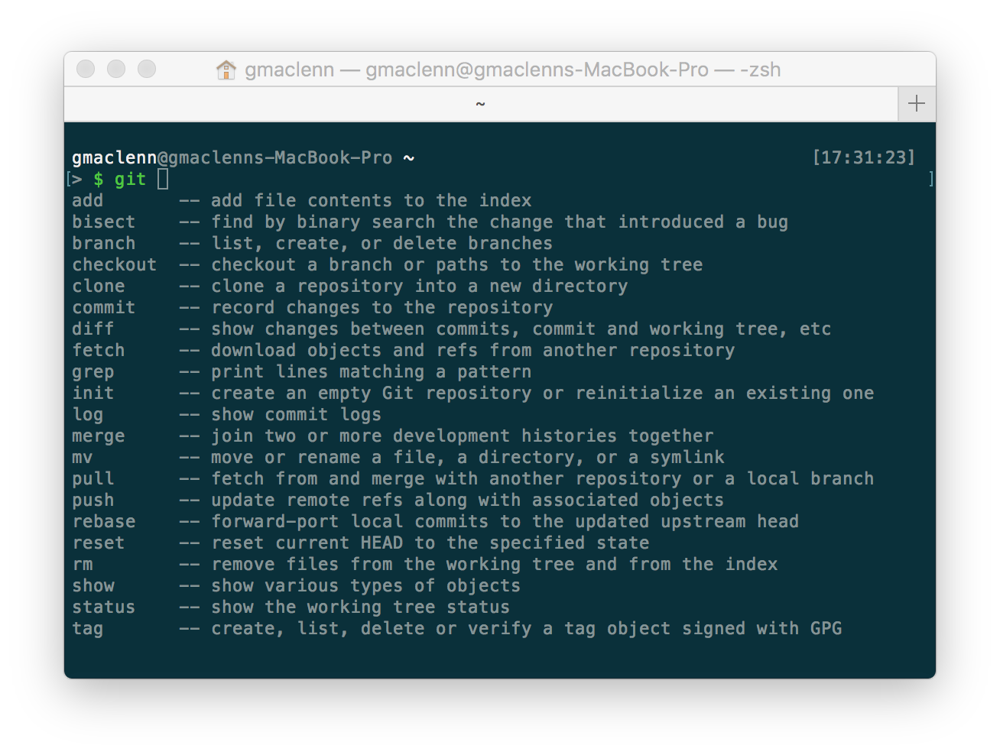

As a data scientist you better know your way around Bash. While you'll want to do serious modeling in Python or R, getting comfortable at the command line will only speed up your work flows. I'll quickly walk through a few packages and tips to make the terminal experience more enjoyable by setting up Zsh as an alternative to Bash.

_The duration of this post will assume you are using a variant of OS X and have Homebrew installed_

#### Features of Zsh Worth Mentioning
_So why do any of this at all?_

Quickly I'll walk through some features that I find very useful in Zsh and if you're still intrigued by the end I'll walk through the very simple process of getting Zsh set up.

##### Autocompletion

One of the best features out of the box for Zsh is autocompletion. While newer versions of bash have some of these features through the _bash-autocompletion_ package which you can brew install, it's not native to bash. With Zsh you can also navigate the completion list, either using the arrow keys or continuing to use tab.

<script type="text/javascript" src="https://asciinema.org/a/1oebvqz23vofdu691rx5csvq3.js" id="asciicast-1oebvqz23vofdu691rx5csvq3" data-speed="1.5" async></script>

##### Tab Completion
When you're using Tab to view possible options in bash it starts up a new prompt after each tab, whereas with Zsh the options drop down within the same prompt.

Bash Example:
<script type="text/javascript" src="https://asciinema.org/a/bq7mvtrcw42ipx6jodydc496l.js" id="asciicast-bq7mvtrcw42ipx6jodydc496l" data-speed="1.8" async></script>

Zsh Example:
<script type="text/javascript" src="https://asciinema.org/a/3ny1h8ta3m834nhhp6ofpyzgu.js" id="asciicast-3ny1h8ta3m834nhhp6ofpyzgu" data-speed="1.4" async></script>

##### Path Expansion
It's easier to show than to describe, but essentially another very fast way of navigating to directories.

<script type="text/javascript" src="https://asciinema.org/a/cjdxxgm8vlxs4g36a4q2uddh1.js" id="asciicast-cjdxxgm8vlxs4g36a4q2uddh1" data-speed="1.5" async></script>

Now this requires you to know the path heirarchy very well to utilize but it's still quite handy.

### Getting Started
If I've successfully convinced you that this is worth your time at all then follow along below. This is all very easy to accomplish if you have Homebrew installed so we're going to start with that.

#### Installing HomeBrew
Homebrew is a package manager that greatly simplifies managing installations in OS X. If you don't already have it you can find simple instructions on how to get started with [Homebrew](https://brew.sh/).

#### Installing Zsh
If you've never heard of Zsh don't be concerned. Zsh (Z SHell) and Bash (Bourne Again SHell) are both shells that are available on most systems. You have both pre-installed on your computer already and they are very similar in nature. Bash is generally the default on OS X systems. However, the pre-installed versions of Bash and Zsh that ship with your computer are generally pretty outdated.

If you run `echo $BASH_VERSION` you can see that your bash version should still be stuck at 3.2 or something like that, last updated in 2007. At time of writing this blog Bash is up to 4.4.12 Zsh is up to 5.3.1.

To install newer versions of bash and Zsh with Homebrew is pretty simple. Open your terminal and enter:
```sh
brew install bash
``` 
or 
```sh
brew install zsh
```
At the end of the install you will probably see some instruction from Homebrew that looks like this:
```
==> Caveats
In order to use this build of bash as your login shell,
it must be added to /etc/shells.
```
We'll walk through doing this in just a moment.

It's important to note that Homebrew installs packages to `/usr/local/bin/` by default so in order to use these updated versions you'll need to append the Homebrew path to the `/etc/shells` directory. The shells file is just a list of whitelisted acceptable shells that looks like this:

```sh
# List of acceptable shells for chpass(1).
# Ftpd will not allow users to connect who are not using
# one of these shells.

/bin/bash
/bin/csh
/bin/ksh
/bin/sh
/bin/tcsh
/bin/zsh
```
 In order to use the updated versions first initiate a shell as the root user with the below command.

```sh
sudo -s
```
Enter your root password. Then append the path of the newly installed bash and zsh (via Brew) to the /etc/shells file with the below code.

```sh
echo /usr/local/bin/bash >> /etc/shells
echo /usr/local/bin/zsh >> /etc/shells
```
Finally, you can change the default shell globally by entering `chsh -s /usr/local/bin/bash` (the newly upgraded Bash) or `chsh -s /usr/local/bin/zsh` if you want to use the newly upgraded Zsh.

Another way to achieve this task is navigating to System Preferences -> Users & Groups, then control click on the current user and open Advanced Options. Within Advanced Options you can type or paste `/usr/local/bin/zsh` or `/usr/local/bin/bash` for the Login Shell to modify the default. Note that if you select `/bin/bash` or `/bin/zsh` from the drop down you will be setting the default to the outdated pre-installed versions.

##### oh-my-zsh
With Zsh it's really easy to modify the appearance. There are a number of different packages out there but the most common is [oh-my-zsh](https://github.com/robbyrussell/oh-my-zsh). Simply put it's an open source framework for managing zsh configurations. Some quick notes before installing, you should be on an OS X or Linux system, Zsh should be installed (we just went through that process) and you should have git and curl or wget. Then run either of these commands in a terminal window.

via curl
```sh
sh -c "$(curl -fsSL https://raw.githubusercontent.com/robbyrussell/oh-my-zsh/master/tools/install.sh)"
```

via wget
```sh
sh -c "$(wget https://raw.githubusercontent.com/robbyrussell/oh-my-zsh/master/tools/install.sh -O -)"
```
For more info check out the [Installing Zsh](https://github.com/robbyrussell/oh-my-zsh/wiki/Installing-ZSH) page on github.

If you have modified your path in `~/.bash_profile` or `~/.bashrc`you will need to do this again in your `~/.zshrc` config file. For instance, I use rbenv to manage my ruby installations and keep this blog running, so I've added that to my `PATH`.

```sh
export PATH="$HOME/.rbenv/bin:$PATH"
```

Once you get set up you can quickly change themes just by modifying the `ZSH_THEME` environment variable in your `~/.zshrc` file. Personal favorites of mine are mh, bureau, theunraveler and agnoster, but there are many you can choose from.

```zsh
ZSH_THEME='bureau'
```

##### Oh-my-zsh Plugins
Once you've gotten the hang of Zsh, you may want to check out some of the plugins that are available in oh-my-zsh. By default there are over 200+ plugins already installed with oh-my-zsh. This is a downside for those who are looking to keep things light, however it makes it very easy to add additional functionality out of the box. If you look at your `~/.zshrc` file you may see a line that looks like this `plugins=(git brew)`. If you do that's great, you can add other plugins by just specifying their name and leaving a space between plugins. Otherwise you can just add a line that looks like the above. You can find a list of the plugins available [here](https://github.com/robbyrussell/oh-my-zsh/tree/master/plugins). Keep in mind that adding too many plugins may slow things down a bit for you. Plugins will just add handy functions and aliases for the given language or framework that you add to make life a little simpler. For more information read the oh-my-zsh repo.

The git plugin shows a list of git commands after typing git and then pressing TAB.


##### Syntax Highlighting
zsh-syntax-highlighting is another great feature that makes the command line a more pleasant experience. Essentially it just lets you know when you're entering a valid command or not.

<script type="text/javascript" src="https://asciinema.org/a/c4u38k090uynjlxbpvu9bzdof.js" id="asciicast-c4u38k090uynjlxbpvu9bzdof" data-speed="1.5" async></script>

The easiest way to install is to use brew `brew install zsh-syntax-highlighting` and follow the insctructions under `==> Caveats` for how to modify your .zshrc file. Alternatively, you may navigate to a directory of your choice and clone the [zsh-syntax-highlighting](https://github.com/zsh-users/zsh-syntax-highlighting) repo. `git clone git://github.com/zsh-users/zsh-syntax-highlighting.git`

Then open up your `~/.zshrc` file and add `source ~/zsh-syntax-highlighting/zsh-syntax-highlighting.zsh`. This above command is assuming you cloned the repo into your home directory. Essentially just make sure you source the correct path to the zsh-syntax-highlighting file. Note the _source_ command must be at the **end** of `~/.zshrc`.

Then run `source ~/.zshrc` to enable the changes you just made. For any further installations or instructions for install not in OS X go to the [INSTALL.md](https://github.com/zsh-users/zsh-syntax-highlighting/blob/master/INSTALL.md) instructions in the github repo.

##### Z
Z is simply a script that makes navigation around file directories much easier. Any time you use `cd` to navigate into a directory, `Z` stores that information in a file located at `~/.z`. So in the example below, once I've run the command `cd ~/src/gmaclenn.github.io` I can now just type `z gith` and Z will autocomplete the path. If there are multiple paths available, then you will simply get a dropdown list. You're also able to use `popd` to return back to where you came from as you'll see in the video below.

<script type="text/javascript" src="https://asciinema.org/a/9cwhxs543a6pkupee8s3evsti.js" id="asciicast-9cwhxs543a6pkupee8s3evsti" data-speed="1.2" async></script>

Z is easy to install, just do `brew install z` and then following the insctructions under `==> Caveats` for how to modify your .zshrc file or by adding the following:

```sh
. $(brew --prefix)/etc/profile.d/z.sh
```

##### Solarized Color Scheme
This is a real rabbit hole where you can spend tons of time. However, I found it worthwhile to use the Solarized theme to make Terminal and VIM more enjoyable. If you simply want a nicer dark blue background that's less abrasive than pure black or white you can run `git clone git://github.com/altercation/solarized.git` and then open up the file `Solarized Dark ansi.terminal` under the `osx-terminal.app-colors-solarized` folder. That should give you a new color background option in Terminal, and with some wrangling of the VIM colorscheme and README located there you can get the rest of the color scheme for working with documents in VIM. There's a lot that depends on configurations and specific usage so I won't delve too deep into that here but know it's an option.

#### Wrap Up
So I've hardly even scratched the surface of capabilities here but if you've never heard of Zsh and were looking for some ways to add functionality to your command line usage this is not a bad place to start.


